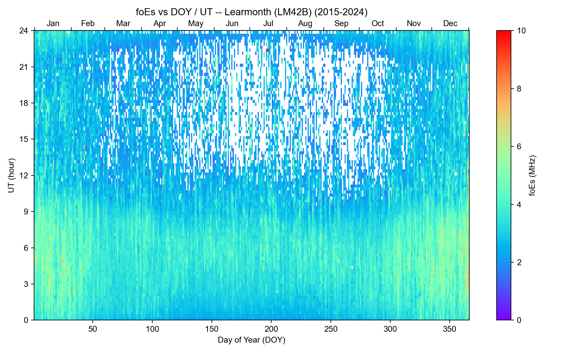
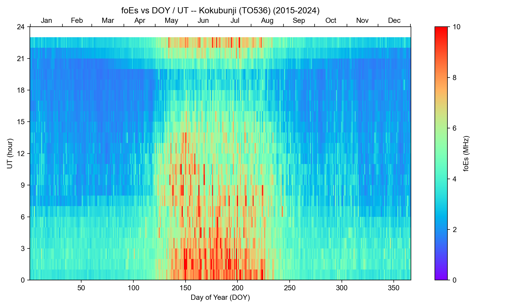

# foEs DOY-UT Plotter

Download sporadic-E critical frequency (**foEs**) records from ionosonde
stations and plot their seasonal / diurnal climatology as a color map of

- **x-axis:** Day Of Year (DOY)
- **y-axis:** Universal Time (UT, hour)

Currently supports six stations across two independent data sources:
Western Australia (Learmonth, Perth) via the GIRO/DIDBase network, and
Japan (Wakkanai/Sarobetsu, Kokubunji, Yamagawa, Okinawa/Ogimi) via NICT's
own archive.

## Example output

| Learmonth, Australia (LM42B) | Kokubunji, Japan (TO536) |
| --- | --- |
|  |  |

Both show the classic summer-daytime maximum in sporadic-E occurrence and
strength, mirrored in local time between the two hemispheres.

## Data sources and licensing

### 1. GIRO / Lowell GIRO Data Center (LGDC), DIDBase

Live "FastChar.GetBest" web API: `https://lgdc.uml.edu/fastchar/getbest`

| Station | Code | Longitude | Latitude | Digital record since |
| --- | --- | --- | --- | --- |
| Learmonth | `LM42B` | 114.10E | 21.8S | 2004 |
| Perth | `PE43K` | 116.13E | 32.0S | 2015 |

Data are released under **CC-BY-NC-SA 4.0**. If you use this data in a
publication, acknowledge the station data provider as required by the
[Rules of the Road for LGDC data access](https://ulcar.uml.edu/DIDBase/RulesOfTheRoadForDIDBase.htm).

### 2. NICT (National Institute of Information and Communications
   Technology), World Data Center for Ionosphere, Japan

Manually-scaled hourly values, static per-year text files:
`http://wdc.nict.go.jp/Ionosphere/archive/observation-history/factor-manual-<code>-<year>H.sjis.txt`

| Station | Code | Longitude | Latitude |
| --- | --- | --- | --- |
| Wakkanai/Sarobetsu | `WK546` | 141.75E | 45.16N |
| Kokubunji (Tokyo) | `TO536` | 139.49E | 35.71N |
| Yamagawa | `YG431` | 130.62E | 31.20N |
| Okinawa/Ogimi | `OK426` | 128.15E | 26.68N |

Times in the raw files are JST (JST = UT + 9h); the script converts them to
UT before plotting, to stay consistent with the GIRO-station convention
above. See NICT's site for the current terms of use; acknowledging NICT as
the data source is customary when this data is used in a publication.

Note: NICT does not currently feed live data back to GIRO -- as of this
writing GIRO's own records for Japanese stations stop in 2001 (Kokubunji)
and 2003 (Okinawa), and it has never carried Wakkanai/Sarobetsu or
Yamagawa. NICT's own archive is therefore the only source for recent
Japanese foEs data.

## Requirements

```
pip install requests pandas numpy matplotlib
```

## Usage

```
python plot_foes_doy_ut.py --station LM42B --year-start 2015 --year-end 2024
python plot_foes_doy_ut.py --station PE43K --year-start 2016 --year-end 2024 --doy-bin 5
python plot_foes_doy_ut.py --station TO536 --year-start 2015 --year-end 2024
python plot_foes_doy_ut.py --station WK546 --year-start 2015 --year-end 2024 --per-year
```

### Options

| Flag | Default | Description |
| --- | --- | --- |
| `--station` | `LM42B` | `LM42B`/`PE43K` (Western Australia, GIRO) or `WK546`/`TO536`/`YG431`/`OK426` (Japan, NICT) |
| `--year-start`, `--year-end` | `2015`, `2024` | Inclusive calendar-year range |
| `--doy-bin` | `1` | Bin width along the DOY axis, in days |
| `--ut-bin` | `1.0` | Bin width along the UT axis, in hours (e.g. `0.25` for 15-minute bins) |
| `--min-cs` | `0.0` | Minimum GIRO autoscaling confidence score to keep (0-100); manually-scaled (`CS==999`) and unknown (`CS==-1`) records are always kept |
| `--outdir` | `.` | Output directory for cached CSVs and PNGs |
| `--no-cache` | off | Ignore/overwrite any cached CSV and re-download |
| `--per-year` | off | Also save one DOY-vs-UT plot per individual year, in addition to the combined-range plot |

### Output

Each run writes (into `--outdir`):

- `<station>_foEs_<year_start>-<year_end>.csv` -- cached raw time series
  (`time` in UT, `foEs` in MHz, `CS` confidence score), so re-plotting or
  re-binning doesn't require re-downloading.
- `<station>_foEs_DOYvsUT_<year_start>-<year_end>.png` -- the combined
  DOY-vs-UT plot (mean foEs per bin, `rainbow` colormap, fixed 0-10 MHz
  color scale).
- With `--per-year`, one additional `<station>_foEs_DOYvsUT_<year>.png` per
  calendar year.

GIRO downloads are rate-limited by the server; the script retries 429
responses with backoff and pauses briefly between per-year requests. NICT
downloads are static files with no such limit.

## License

Code in this repository is released under the [MIT License](LICENSE). The
ionosonde data it downloads is **not** covered by that license -- see
"Data sources and licensing" above.
